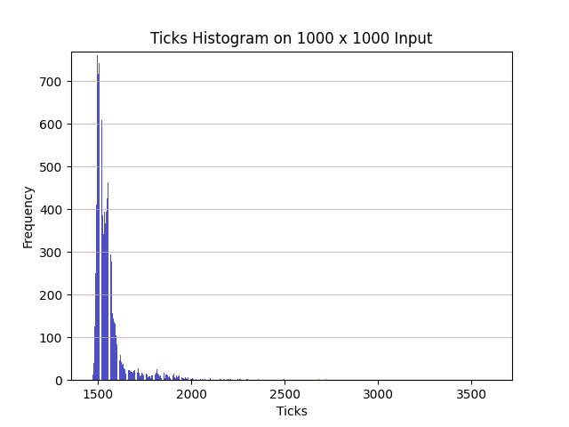
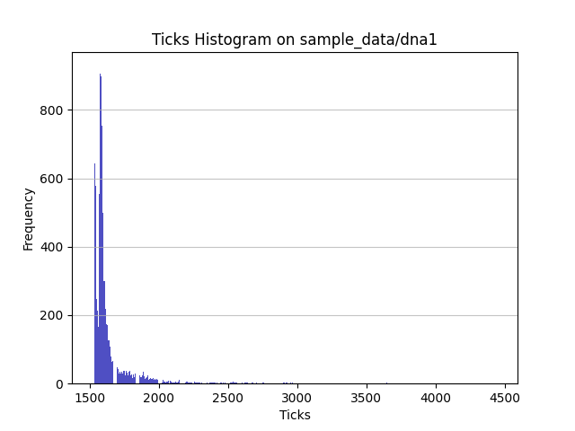
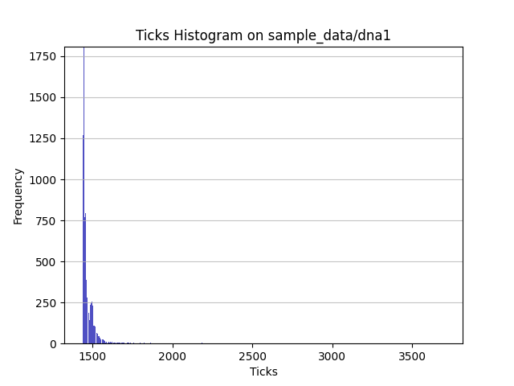

CSEE 4824: Computer Architecture HW5
====================================

Stanley Yu, sy2751

December 23, 2020

Optimization 0: Baseline Algorithm
----------------------------------

To compile the program, we use the `-O2` flag to keep compiler optimizations
consistent between programs:

```bash
gcc -O2 <xyz_lcs.c>
```

where "xyz" is replaced with the choice of program ("base" for the baseline).
To run the baseline program, do:

```bash
./a.out <file-1> <file-2>
```

The baseline program uses a dynamic programming approach to solving the LCS
problem. We can write a recurrence relation V(i,j) where V(i,j) gives the
optimal value for two strings of length i and j. Then, we can say
V(i,j) = V(i-1,j-1) + 1 if the letters at i and j match and
V(i,j) = max(V(i-1,j), V(i,j-1)) if they don't match
This solution works because of the problem's optimal substructure property: we
can construct the optimal solution for a problem based on optimal solutions to
its subproblems.

While the dynamic programming solution is already an optimization over the
brute-force approach of recursing through all subproblems, I choose to use the
dynamic programming approach as the baseline because it is a well-known solution
to the problem commonly taught in algorithm courses. It is also more of an
algorithmic optimization that offers insight into avoiding redundant operations
in a recursive solution rather than insight about hardware.

However, I do implement an extra optimization that minimizes the amount of space
needed for the program to run. Instead of storing the entire matrix for
computing cells, I keep just one array to store all values and replace elements
in the array row-by-row. While it may be hard to predict what the runtime
improvement is for this optimization, this design is key to allow the program
to be able to ingest strings of up to hundreds of thousands of characters in
a reasonable time. I have documented some of those values below and graphed the
distribution for inputs of size 1000 x 1000 to show the variation.

We can bound the runtime of the algorithm for an input of size m and n by
O(mn), since it calculates a total of mn values, each cell taking constant time,
to reach the optimal solution. Due to the space optimization, the upper bound
for space becomes O(min(m,n)) rather than O(mn). For strings consisting of
100,000+ characters, this avoids memory problems such as stack overflow or OOM
issues.

| Number of Input Characters | Average Ticks         |
| ---                        | ---                   |
| 8 x 8                      | 1.2328                |
| 16 x 14                    | 1.4647                |
| 1000 x 1,000               | 1541.391              |
| 100,000 x 100,000          | 26035670 (26.04 sec)  |
| 300,000 x 300,000          | 252732051 (252.7 sec) |

Note: The ticks in the table are averaged over 10,000 runs, except for the last
two rows, which is averaged over 10 runs. Also, to calculate the number of
seconds, my hardware runs on 10^6 ticks per second.

<p align="center">
    
</p>

Optimization 1: Caching
-----------------------

In this optimization, I take advantage of better sequential accesses to memory
to optimize cache use. The high-level approach is instead of computing the
matrix row-by-row, we compute elements column-by-column in chunks the size of
a cache line. This takes advantage of caching since each row needs to be
accessed again for the next row, and it is possible for large row sizes for
a chunk of the previous row to be overwritten by a different chunk in the row.
This strategy theoretically would avoid having to incur these extra memory
accesses by computing all values in the column window before moving to the next
chunk. Note that this approach is only possible because we don't store the
entire matrix in memory, only one row, so we don't incur extra memory accesses
by iterating over columns first.

It's not quite apparent what kind of speedup to expect, but if I estimate the
difference in magnitude between a cache access and memory access to be about
10x, then this optimization will likely scale to larger improvements on larger
input sizes, since the cache is less likely to be utilized optimally on large
inputs for the baseline.

### Implementation (`opt1_lcs.c`)

The implementation builds off of the baseline code. First, we need to specify
a chunk window the size of a cache line to compute in each iteration.
According to `/sys/devices/system/cpu/cpu0/cache/`, the cache line size of one
of my CPU's cores is 64B. Thus, using 32-bit integers, I can store 16 elements
of the dynamic programming memo in a single cache line, represented in the code
as a window of size 16 (`int start` is the start of the window and `int end` is
the end).

The second major change is the need for a new array, `prev_store`, to store the
`prev` element as we slide the window. Since we overwrite the last element of
each window every row, we need the array to store the end of the window for each
row to use in the next chunk window. There is no way to chunk this array in the
same way we are chunking the rows because we access each element sequentially
row-by-row in our computation. However, this is still significantly better than
the baseline algorithm, since the baseline reaccessed all m elements n times,
while the `prev_store` is only needed at the beginning and end of each window.
There are additional minor changes to make the program correct.

### Performance Improvement 1

The speedup is less apparent for small-to-medium input sizes, since the size of
my CPU's cache is likely large enough to contain all of `mat` for small sizes,
making the optimization more or less of a small unnecessary overhead to also
store windows and `prev_store`. This can be shown in the observed results:
the average ticks increases on inputs of size 1000x1000. However, comparing the
histogram to the baseline's, it seems that the distribution is also slightly
more consistent, as the mode rises above 800 and the distributions seem more
compact. This is likely due to avoiding context switches or avoiding the
overhead from conflict misses in the cache, making the measurements more
predictable.

For larger input sizes, the tests show significant improvements. For
instance, on inputs of size 100,000 characters per string, there is a consistent
2x improvement! Below is a table of the observations as well as a graph of the
code on 10000x10000 input to visualize the distribution. The average ticks are
averaged over 10 runs, except for the first row, which is over 10,000 runs.

However, this result is somewhat different from expected results. For one, the
improvements actually slow down when scaling on input size. This is likely due
to the cost of memory accesses becoming dwarfed by the time to run the entire
program. As can be observed, even though the gap between times is larger in raw
value between 300,000 x 300,000 size inputs than the gap for 100,000 x 100,000
inputs, the gap is less than 2x.

| Number of Input Characters | Average Ticks         |
| ---                        | ---                   |
| 1,000 x 1,000              | 1635.5152             |
| 100,000 x 100,000          | 14481509 (14.48 sec)  |
| 300,000 x 300,000          | 176363148 (176.4 sec) |

<p align="center">
    
</p>

Optimization 2: Instruction-Level Parallelism
---------------------------------------------

In my second optimization approach, I build off of `opt1_lcs.c` to exploit
instances of instruction-level parallelism.

First, I noticed that the `lcs` function calls the `max` function very
frequently, even though `max` is a very simple comparison between two values.
This suggests that making the `max` function both static and inline will
translate to speedups at the instruction-level, since this reduces the overall
number of code blocks and adds more independent instructions to each one, a
modern CPU should be better able to take advantage of parallelism using its
multiple cores and threads.Also, modern compilers perform some level of branch
prediction, so this should grant speedups for parallelizing the large number of
branches in the code.

Second, I minimized the use of local variables by reducing the number of
assignment instructions in the code. This prevents temporary and implicit
variables from being stored on the stack as often, which can give some speedups
since accessing registers is highest in the memory hierarchy.

I don't expect these optimizations to grant massive improvements in performance,
since they are not typically bottlenecks in the code (currently, the bottleneck
seems to be the serial nature of the problem). However, the benefits should
scale with input size, since larger input sizes creates more calls to `max`,
leading to more instructions executed and hence, better benefits from
parallelizing at the instruction-level.

### Performance Improvement 2

The results seem to match expectations. Even though the redution in runtime is
only about 2 seconds for an input size of 1000x1000, the reduction becomes
over 10x larger for almost 40 seconds of speedup at 300,000x300,000. This is
likely to compound for even larger input sizes.

I have also documented and graphed the distribution at 1000x1000 again, to show
the variation. This graph demonstrates probably the greatest benefit of these
optimizations at smaller input sizes: there is a large improvement in
consistency of the ticks and a large reduction compared to the overall runtime.
As shown in the graph, the frequency of the mode improved massively to over
1750, and the average lowered even below the baseline. The likeliest explanation
is that inlining functions makes the code much less prone to unpredictable
outliers due to longer memory accesses, which can be significant at small input
sizes since a small difference amounts to a relatively large speedup.

| Number of Input Characters | Average Ticks         |
| ---                        | ---                   |
| 1,000 x 1,000              | 1478.5202             |
| 100,000 x 100,000          | 12723154 (12.72 sec)  |
| 300,000 x 300,000          | 137156630 (137.2 sec) |

<p align="center">
    
</p>

Appendix
--------

- The sample data is organized as `<case_name-x.txt>`, where `case_name` is the
test case name (such as `dna1`), and `x` is the number of the input file per
case (either 1 or 2). `out.txt` stores the expected output for each test case as
well as information on the input sizes.
- To recreate the graphs, the C programs must be edited to only output the
number of ticks to stdout, or the script will fail.
